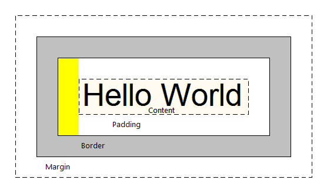
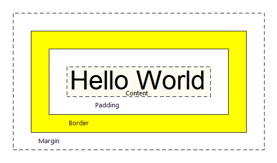

# CSS Box Model

The browser represents each HTML element as a rectangular box, with the box's **content**, **padding**, **border**, and **margin** built up around one another like the layers of an onion.

## OBJECTIVE

1. To learn how the CSS box model works
2. To define the properties that makeup the CSS box model:
    * What is content?
    * What is padding?
    * What is a border?
    * What is a margin?

## OPENING EXERCISE

In the repository for this lesson there is an **index.html** and **style.css**. Please download both files and place them in the **same** directory. Open the **style.css** in your favorite code editor and open the **index.html** in your web browser (Google Chrome). Uncomment the padding, border, and margin properties in **style.css** and play around with them.

**From there, what did you observe? What is padding, border, or margin?**

```
  padding: px;
  border: width border-style color;
  margin: px;
```

## CONTENT


The **width** and **height** properties set the width and height of the content box, which is the area in which the content of the box is displayed.

```
/* MAIN IS THE NAME OF THE CLASS WE GAVE THE DIV IN THE INDEX.HTML */
.main {
  width: 50%;
  height: 100%;
}
```

## PADDING


Padding refers to the transparent space **outside** of the content but **inside** of the border. The size of this layer can be set on all four sides at once with the padding shorthand property, or one side at a time with the padding-top, padding-right, padding-bottom and padding-left properties.

### SHORTHAND

ADDS EQUAL PADDING ON ALL FOUR SIDES
```
  padding: 10px;
```

### LONGHAND

ADDS EQUAL PADDING ON ALL FOUR SIDES
```
  padding: 10px 10px 10px 10px;
```

OR SPECIFY WHICH SIDE TO ADD PADDING TO

```
  padding-top: 10px;
  padding-right: 10px;
  padding-bottom: 10px;
  padding-left: 10px;
```

## BORDER


The border goes **around** the padding and content but sits **inside** of the margin. By default the border has a size of 0 — making it invisible — but you can set the thickness, style and color of the border to make it appear. Just like padding, border has a shorthand and longhand approach.

### SHORTHAND

SETS THE THICKNESS, STYLE, AND COLOR ON ALL FOUR SIDES
```
  border: width border-style color;
```

### LONGHAND

```
  border-width: 10px;
  border-color: red;

  border-top-style: solid;
  border-right-style: solid;
  border-bottom-style: solid;
  border-left-style: solid;
```

[Diagram of border styles](../blob/master/extras.md#this-diagram-shows-you-the-available-border-styles)

## MARGIN


Margin refers to the transparent space **outside** of the border. Margin is used to create space between other HTML elements. The size of this layer can be set on all four sides at once with the margin shorthand property, or one side at a time with the margin-top, margin-right, margin-bottom and margin-left properties.

### SHORTHAND

ADDS EQUAL MARGIN ON ALL FOUR SIDES
```
  margin: 20px;
```

### LONGHAND

ADDS EQUAL MARGIN ON ALL FOUR SIDES
```
  margin: 20px 20px 20px 20px;
```

OR SPECIFY WHICH SIDE TO ADD MARGIN TO

```
  margin-top: 20px;
  margin-right: 20px;
  margin-bottom: 20px;
  margin-left: 20px;
```

## VOCABULARY
1. **Content:** The "real" content of the element, such as text, an image, etc...
2. **Padding:** The transparent space outside of the content but inside the border.
3. **Border:** The area that goes around the padding and content but sits inside of the margin.
4. **Margin:** The area used to separate the element from its neighbors by creating transparent space outside of the border.

## EXIT EXERCISE

1. At this point, has your understanding of content, padding, border or margin changed?
2. Let's define the four properties that make up the CSS box model.
3. How are padding and margin different?
4. Do you see a pattern between padding and margin? If so, what is it?

🔥🔥 **5.** **We didn't cover this, but in the longhand approach to padding and margin, what do you think each value represents?**

```
  padding: px? px? px? px?;
  margin: px? px? px? px?;
``` 

## ANY QUESTIONS?

## HOMEWORK

STUDY! Test tomorrow! 😁

## ADDITIONAL RESOURCES
1. [More clarity on longhand approach to the CSS box model](../blob/master/extras.md#this-diagram-provides-more-clarity-on-the-longhand-approach-to-the-css-box-model)
2. [Introduction to the CSS box model](https://developer.mozilla.org/en-US/docs/Web/CSS/CSS_Box_Model/Introduction_to_the_CSS_box_model)
3. [The box model](https://developer.mozilla.org/en-US/docs/Learn/CSS/Introduction_to_CSS/Box_model)
4. [MDN Padding](https://developer.mozilla.org/en-US/docs/Web/CSS/padding)
5. [MDN Border](https://developer.mozilla.org/en-US/docs/Web/CSS/border)
6. [MDN Margin](https://developer.mozilla.org/en-US/docs/Web/CSS/margin)